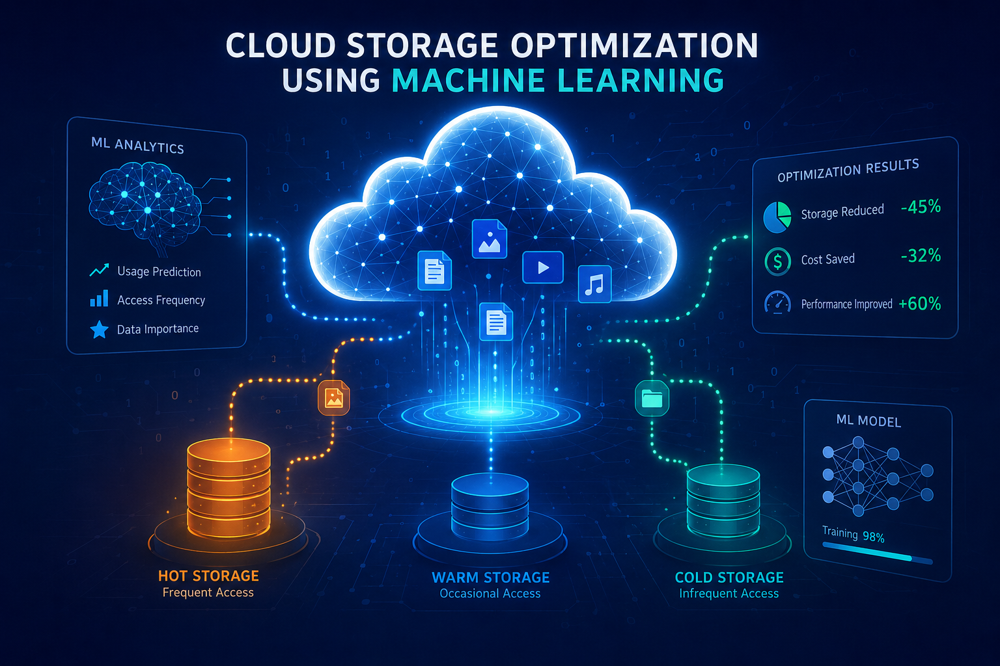

<div align="center">



**Intelligent Cloud Storage Optimization**

*Stop paying premium prices for storage your AI-generated images don't deserve.*

<br/>


<br/>


<br/>


</div>

---

## 📌 The Problem

Cloud platforms store **500+ exabytes** of image data monthly. Existing tiering systems use static, rule-based policies that only check file age or size — they have no concept of *content value* or *authenticity*.

The result:
- 🤖 **AI-generated images** sit in expensive HOT storage long after their brief viral moment
- 📸 **Real, frequently accessed images** get demoted arbitrarily by time-based rules
- 💸 **Storage costs balloon** with no intelligent control

---

## ✅ The Solution

**Utilex** scores every image using two independent signals — *how it's been accessed* and *whether it's real or AI-generated* — and automatically routes it to the right storage tier.

```
Image + Metadata
      │
      ├──► 🤖 AI Detection (C2P-CLIP)  ──► AI Probability Score  (Pₐᵢ ∈ [0,1])
      │
      └──► 📊 Recency Analysis         ──► Recency Score          (R  ∈ [0,100])
                                                    │
                                        ┌───────────▼───────────┐
                                        │   Utility Score (U)   │
                                        │ 0.6×R − 0.4×(Pₐᵢ×100) │
                                        └───────────┬───────────┘
                                                    │
                              ┌─────────────────────┼──────────────────────┐
                              ▼                     ▼                      ▼
                        🔥 HOT Tier           🧊 COLD Tier          🗄️ ARCHIVE Tier
                         U ≥ 36               8 ≤ U < 36                U < 8
```

---

## ⚙️ How It Works

### 🕐 1. Recency Score

Five behavioral metadata signals, each normalized and weighted:

| # | Factor | Weight | Normalization | Why It Matters |
|---|--------|:------:|:-------------:|----------------|
| 1 | Days Since Last Access | **30%** | Inverse | Best predictor of future retrieval |
| 2 | Access Frequency | **25%** | Direct | Measures overall importance |
| 3 | Revisit Rate | **20%** | Direct | Distinguishes organic vs one-off access |
| 4 | Access Decay Rate | **15%** | Inverse | Real images decay slowly (3–15%/wk); AI fast (30–60%/wk) |
| 5 | Access Velocity | **10%** | Shift | Detects rising vs declining interest |

```
R = 0.30·d̂ + 0.25·f̂ + 0.20·r̂ + 0.15·rr̂ + 0.10·v̂       R ∈ [0, 100]
```

---

### 🤖 2. AI Detection — C2P-CLIP

> Powered by **C2P-CLIP** (AAAI 2025) — Injecting Category Common Prompts into CLIP for generalizable deepfake detection.

```
Input Image  →  Resize 224×224  →  Normalize (ImageNet)
      │
      ▼
CLIP Visual Encoder  →  Embedding ϕ(I)
      │
      ▼
Linear Classifier + Category Common Prompts
      │
      ▼
   Pₐᵢ = σ(f(ϕ(I)))

   Pₐᵢ > 0.5  →  🤖 AI-Generated  (penalty applied)
   Pₐᵢ ≤ 0.5  →  📸 Authentic     (no penalty)
```

---

### 🧮 3. Utility Score

```python
if P_ai > 0.5:
    U = 0.6 * R - 0.4 * (P_ai * 100)   # AI penalty → pushes image toward ARCHIVE
else:
    U = 0.6 * R                          # Authentic: score is purely behavior-driven
```

The **60/40 split** was determined empirically — maximizing cost savings through aggressive archiving of synthetic content while keeping authentic, frequently-accessed files in HOT tier.

---

### 🗂️ 4. Tier Assignment

| Utility Score | Tier | Description |
|:---:|:---:|---|
| **U ≥ 36** | 🔥 **HOT** | Premium, low-latency storage |
| **8 ≤ U < 36** | 🧊 **COLD** | Standard access storage |
| **U < 8** | 🗄️ **ARCHIVE** | Lowest-cost archival |

---

## 📊 Results

Evaluated on **301 images** — 150 real photographs + 151 AI-generated synthetics.

### Baseline — Recency Only

| Image Class | HOT | COLD | ARCHIVE |
|-------------|:---:|:----:|:-------:|
| Real (150) | ✅ 100% | 0% | 0% |
| AI-Generated (151) | 0% | ❌ **94.7%** | 5.3% |

> ⚠️ 143 AI images landed in COLD instead of ARCHIVE — recency signals alone can't detect synthetic content.

### Full Utilex Pipeline

| Image Class | HOT | COLD | ARCHIVE |
|-------------|:---:|:----:|:-------:|
| Real (150) | ✅ 100% | 0% | 0% |
| AI-Generated (151) | 0% | 5.3% | ✅ **94.7%** |

### Head-to-Head

| Metric | Recency Only | Full Utilex | Delta |
|--------|:---:|:---:|:---:|
| Real → HOT | 100% | 100% | — |
| AI → ARCHIVE | 5.3% | **94.7%** | **+89.4 pp** |
| Avg Utility Score (Real) | 45.85 | 45.85 | — |
| Avg Utility Score (AI) | +16.85 | **−6.78** | −23.63 |
| Score Gap (Real vs AI) | 29.00 pts | **52.63 pts** | +23.63 |

---

## 🏗️ Project Structure

```
project-practice/
├── backend/                  # Flask REST API + scoring engine + C2P-CLIP integration
├── frontend/
│   └── static/
│       └── ui/               # Dashboard & monitoring interface
└── .gitignore
```

---

## 🛠️ Tech Stack


---

## 🚀 Getting Started

**Prerequisites**


```bash
# 1. Clone the repository
git clone https://github.com/Raghavuchiha/your-repo.git
cd your-repo

# 2. Install backend dependencies
cd backend
pip install -r requirements.txt

# 3. Start the Flask server
python app.py
```

```bash
# Frontend
cd frontend/static/ui
python -m http.server 3000
# Open http://localhost:3000
```

---

## 🔌 API Endpoints

| Method | Endpoint | Description |
|:---:|---|---|
|  | `/recommendations` | Fetch tier recommendations for all stored images |
|  | `/re-evaluate` | Trigger a fresh evaluation run |

---

## 📚 References

- **Mansouri & Erradi** — *Online Cost Optimization Algorithms for Tiered Cloud Storage*, JSS 2020
- **Tan et al.** — *C2P-CLIP: Injecting Category Common Prompt in CLIP*, AAAI 2025
- **Liu et al.** — *RLTiering: Cost-Driven Auto-Tiering via Deep RL*, IEEE 2022
- **AWS** — Amazon S3 Intelligent-Tiering Documentation

---

<div align="center">


</div>
